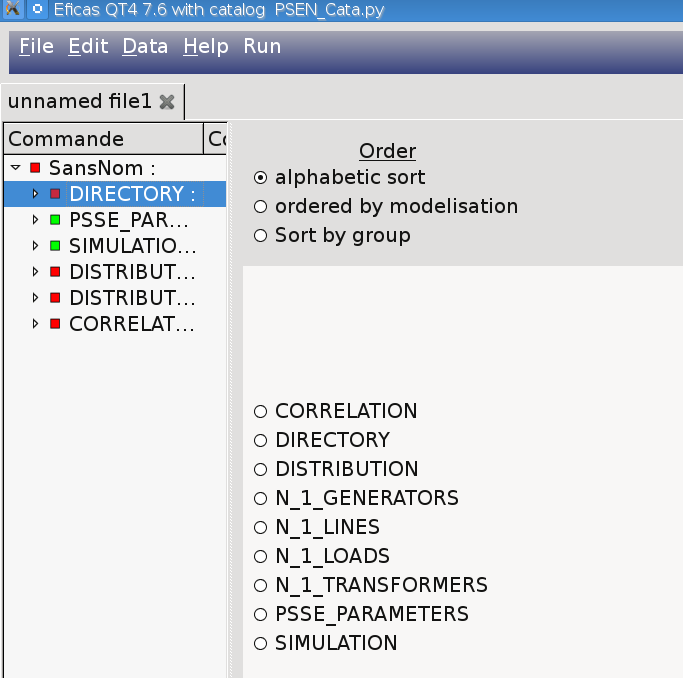
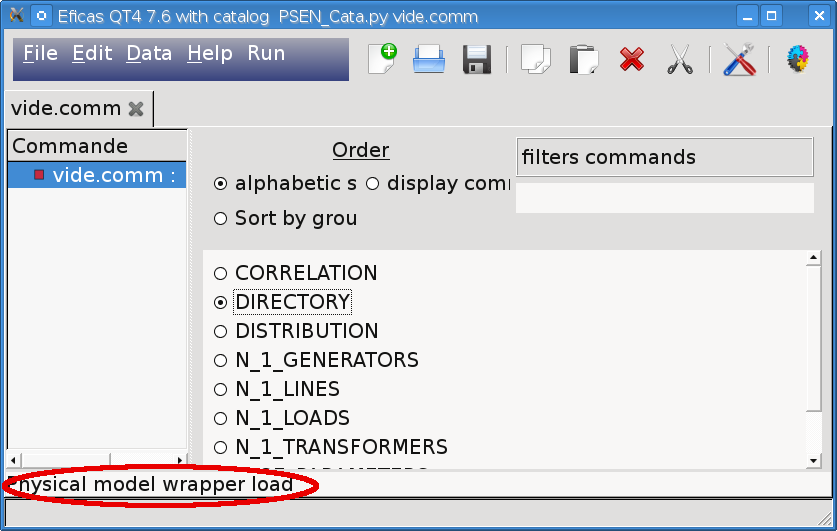
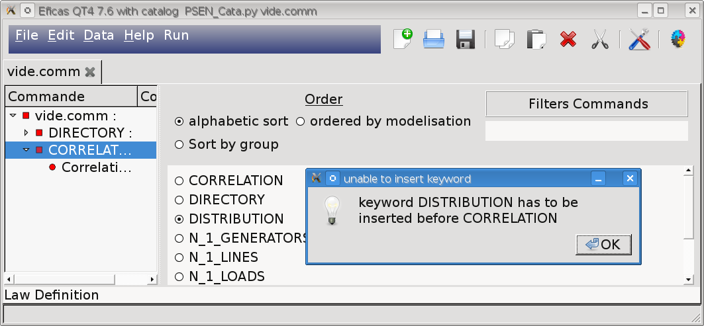
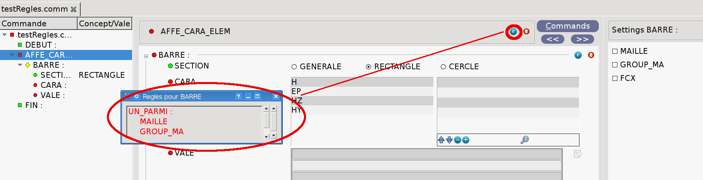
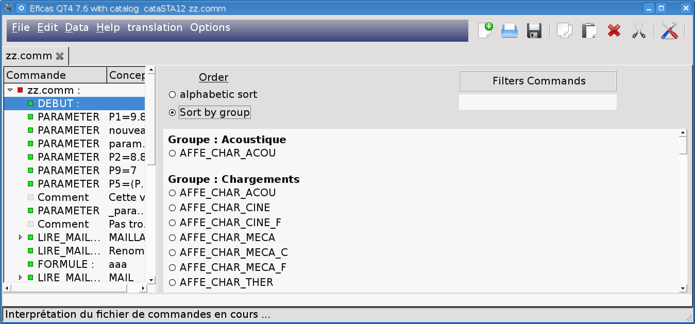
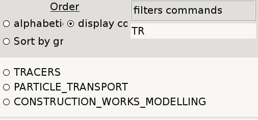
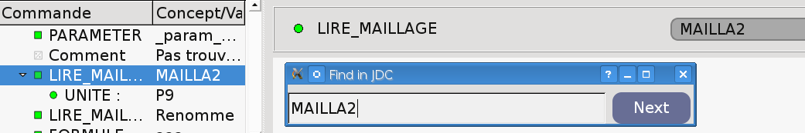

Add a command
=============

Eficas  allows you to create or edit a dataset. Remember it is always possible to save (or read) invalid datasets.
Building dataset consists of adding new commands, entering parameter values and if necessary naming concepts.
see : :ref:`concept-label`.
|
Eficas provides two different widgets : first one allows you to manage commands, second one to enter values for each command.
You can navigate between widgets using arrows or pushbutton.

Command widget shows up at file creation (if the new file is created empty ) or when clicking  on :

Enter commands
---------------

Eficas main widget provided two distinct areas: The left side always contains the dataset explorer as a tree view. The right widget contains all commands the user is allowed to select.
If a dataset consists of a single command, tree view area is not displayed.

|

To have command's **documentation** (if available), **simple-click** on the command. 

|

To **add** the command **click twice.** The new command is added after the current command (highlighted in the tree view). In case of impossibility, a message is displayed.   

|

If the dataset must comply with  building  :ref:`rules-label`, a specific icon appears in the command widget.

 
|

The user  also can choose the way the commands are sorted, either by alphabetical order, either by fonctionnalities.
Last type of sorting commands is called 'by modelisation' that is to say logical order to prepare data for the code.  

|

The content filtering system is very simple : only commands containing the expression are shown.

|

The user can use "Find", which is a filter widget to find a concept or command position in the dataset. The pushbutton "next/suivant" shows the next matching concept/command. 

