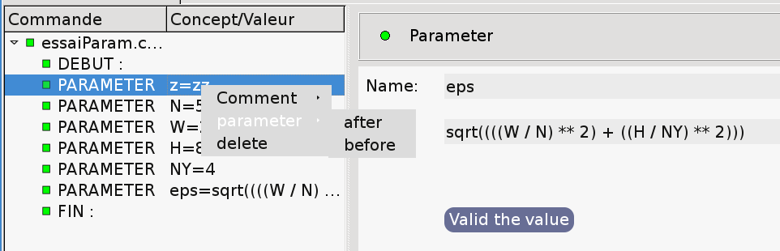
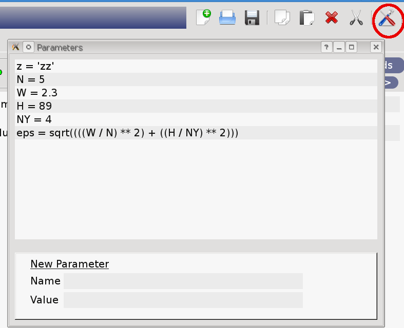
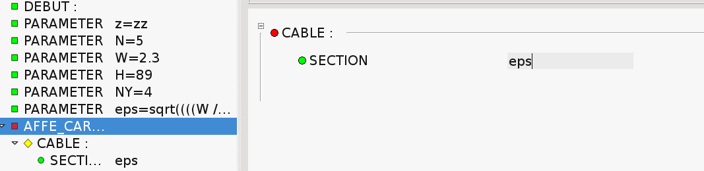
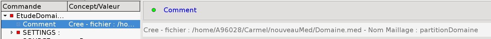

Parameters and comments
========================

Parameters 
-----------
The users can define parameters. As parameters, Eficas accepts :

- Real
- String
- Integer
- List

A parameter's definition can use existing parameters such as :
eps=sqrt((((W / NX) ** 2) + ((H / NY) ** 2)))

right-click menus on tree items allows you to add a parameter.

Pushing on "Parametres" Pushbutton opens a dialog containing all already existing parameters. You can define as many parameters as needed 
at once.

to use a parameter, just type its name.

Comments 
---------

Comments may refer to :

- user annotation. In this case, background label is white.
- generated comment. In this case, background label is light grey.

