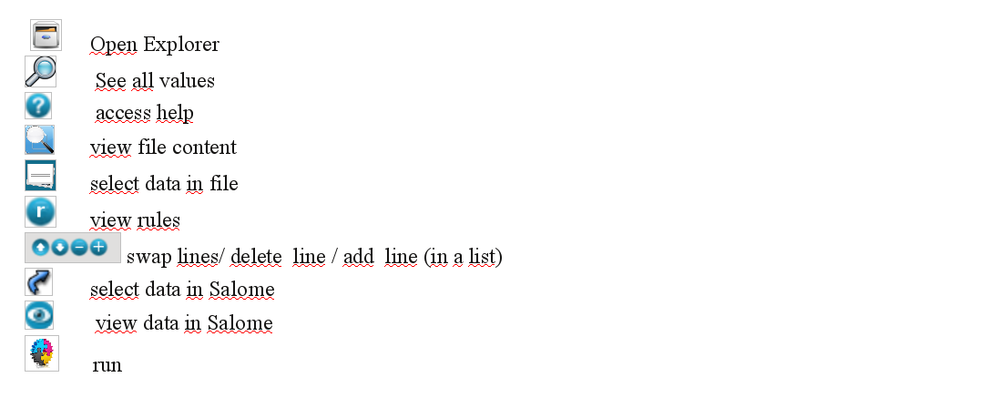

.. _icons-label:

=======================
Using icons in Eficas 
=======================

Icons
-----

Icons are used because they are presumed to save time, but all actions can be accessed from menus. 
Eficas use a small set of icons. Hopefully, users are familiar with. However, all icons are labelled.

Shortcuts
---------

Eficas keybord shortcuts require the user to press a sequence of keys.
These sequences contain 'Ctrl' for common shortcuts as "Ctrl+C", Alt for accessing action of menu, and 'Shift' for specific actions.  Note that 'Shift D' allows expanding/collapsing items

   

