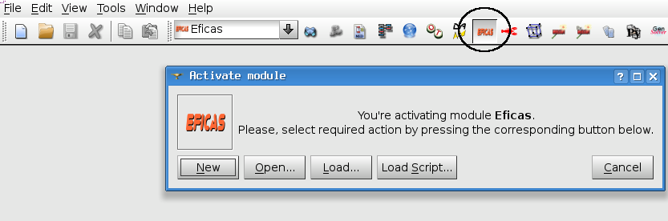
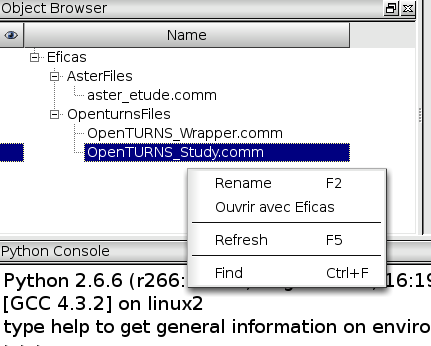
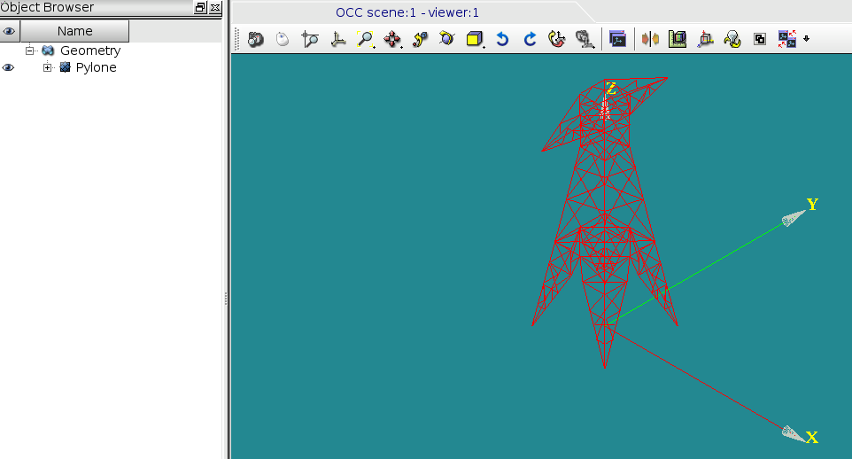
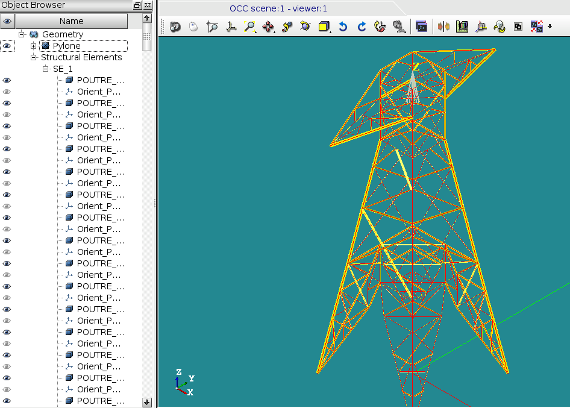

.. _salome-label:

Eficas in Salome (For Aster)
============================

Launching Eficas in Salome
---------------------------
First activate Eficas module

Use Eficas. When a file is saved, Eficas will create an associated entry in the object browser.
It is possible to use the file in other modules (see appropriate module's documentation).

Structural Element
-------------------

Eficas is able to create "structural element" in GEOM or in SMESH in order to
validate data.  

- Create your geometry

- Create your Eficas dataseat, and define for example a beam , with AFFE-CARA-ELEM.

- Click on "View3D". Eficas shows you the result in GEOM and creates "beams" .
  Be aware : these "structural elements" are not "geometry elements". You can't use it.
  It's also possible to verify normals orientation.

