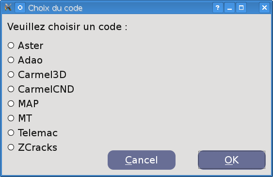
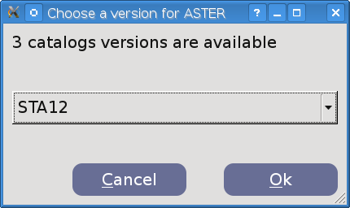

Running Eficas
==============

In Eficas, many common commands can be invoked via menus, toolbar buttons as well as keyboard shortcuts.
As in many GUI, a menu widget can be either a pull-down menu or a standalone context menu. Pull-down menus are shown by the menu bar when the user clicks on the respective item or presses the specified shortcut key. Context menus are usually invoked by some special keyboard key or by right-clicking.
Eficas allows you to write (and reread) an unvalid file. At any time, you can save your works. 

- Eficas is mainly available in Salome, and often from code's modules (for example for Aster or Adao). Otherwise, see how to launch : :ref:`salome-label`. 
- To run Eficas standalone, use command line : python Code/qtEficas_Code.  
- On Windows, use .bat to run Eficas.

*If Eficas is installed on your machine only for one specific code and one specific version of this code, skeep the two next steps.*

 

Choose a Code ...
------------------

Unless you have started Eficas for a specific code, Eficas will ask you to choose the code you want to work with, 
each time you click on "Nouveau/New" or "Ouvrir/Open" in the "Fichier/File" menu.

and a version of the Code
----------------------------

if many catalogs (ie many versions ) are available, Eficas will ask you to select one.

