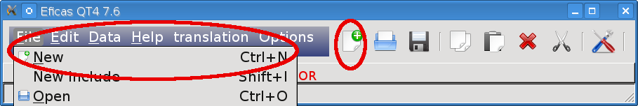
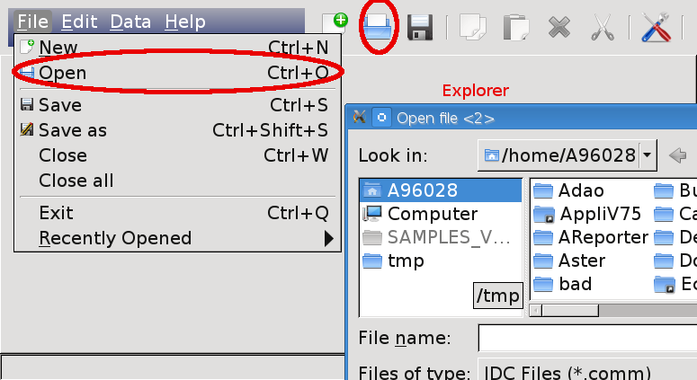
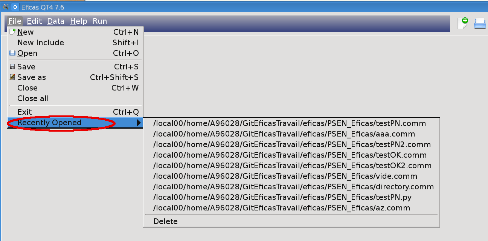
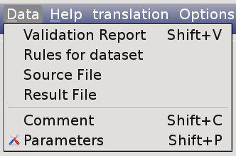
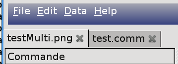
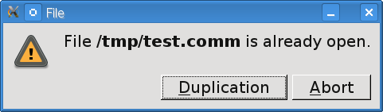

First step
===========

Build a new dataset.
---------------------
Launch Eficas and choose "Nouveau/New" in "File" menu. 

For some codes (Telemac or PSEN), simulation dataset are  pre-filled with mandatory keywords. Users complete the dataset with values
and add new commands if needed. In this case, the window that allows to :ref:`form-label` appears.

Open an existing dataset.
---------------------------
Launch Eficas and choose "Open/Ouvrir" in "File" menu. It shows up a file Open/Save dialog window.

Open a "Recently Used" dataset.
--------------------------------
To open a document that you recently used, click "File" , point to "Recently Opened", and then click the item that you want to open.

To clear the contents of the list, click 'Delete' item.

Data/Jdc Menu.
----------------

- Why is dataset unvalid?
  Click on Validation Report item. 

- "Rules for dataset"  displays the rules you have to respect when building a dataset

- "Source File" item allows to check the source file.

- "Result File" item allows to check the .comm result.
  It allows you to save the dataset in a file (for Adao Study for example) 
   
- "Comment" item add a comment at the beginning of the dataset.

- "Parameters" allows you to manage parameters for the dataset.

Open Multiple dataset.
----------------------

You can open multiple datasets. Each file is associated with a different page and is shown by clicking on its tab.

Open twice the same dataset.
----------------------------
You can open twice the same dataset (in order to create a copy and rename it). Eficas warns you :

In case of duplication, Eficas does not assure coherency between the two copies.

The dataset is valid.
---------------------
Once the dataset is valid, you can lauch your code (in particulary PSEN, Carmel). Use 'run' icon 
or choose "Run" in the menubar.

