.. _form-label:

===============
Edit a command
===============

Each command has to be setted up. Eficas generates a data entry form.
This form varies dynamicaly, depending on the context : rules and already existing values.

This widget appears by selecting (clicking) on a command (first level in the tree view).

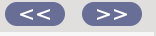

You can navigate from command to command using the arrows buttons:

The command widget
--------------------

this widget is divided vertically into three separate areas : 
   - the tree view, 
   - the form widget  
   - the optional keywords. 

When needed, views provide scrollbar so that the entire information can be viewed.

A bottom widget provides a horizontal bar for presenting documentation as the status bar  is used to display error or warning messages.
    
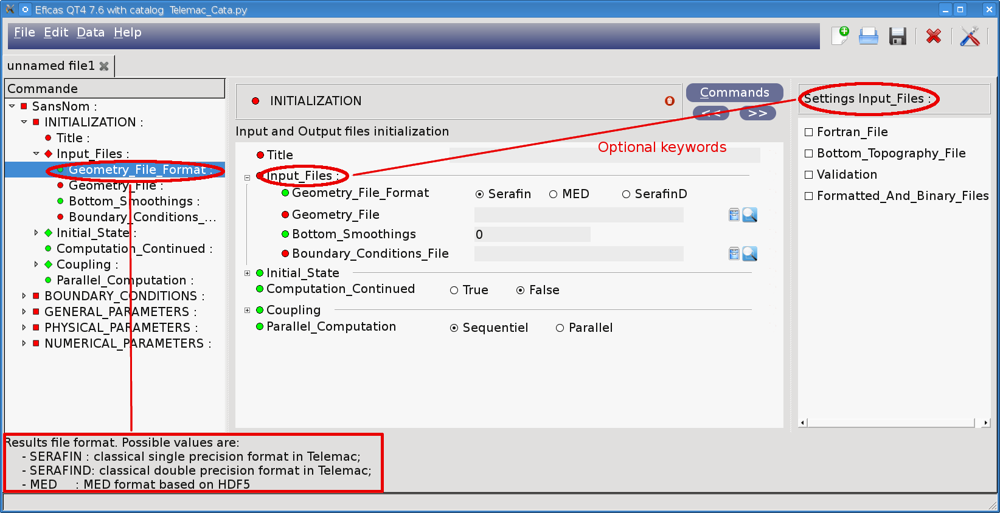

|
|

Edit values
-------------

Eficas uses many different widgets in order to help you to choose values :

- Line editors for simple values
- Entry lists widgets 
- Popup lists
- Group boxes of button

see :ref:`features-label` to know more about each widget.
 

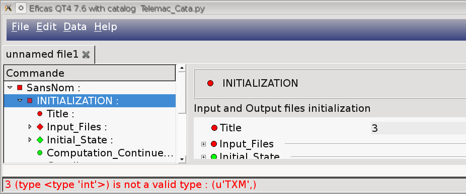
Eficas does not let you enter invalid values. It checks the type and the cardinality of the value. 
It ensures that the value is in the value domain or proposes  a set of discrete values.
Data entered is checked against a set of rules. Errors are displayed in red to draw attention.

Form construction is dynamic
----------------------------

The form is updated according to values. It asks for the field depending on what's selected.

In the example below: 

- if value of 'Initial_Conditions' is 'Zero Elevation', no additional data is needed

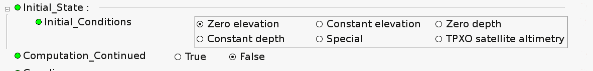

- if value of 'Initial_Conditions' is 'TPXO satellite altimetry', you have to fill 'Ascii_Database_For_Tide'

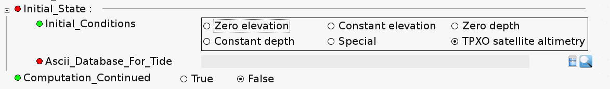

Displaying optional keyword
------------------------------

When you create a new command, the widget opens with the optional keywords of this command. 

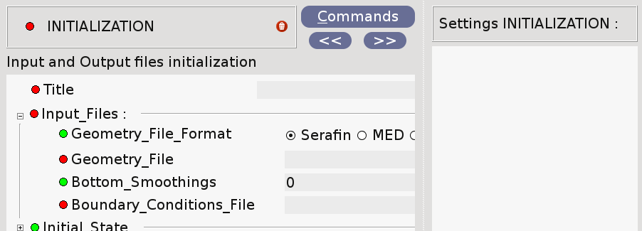

When entering in a "group keyword", the optional keywords list is updated to show optional keyword for this specific "group keyword".

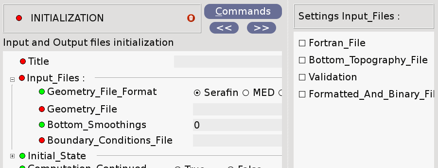

By clicking on command label ("INITIALIZATION") or on keyword label ("Input_files"), the corresponding optional keywords list is displayed.

Sometimes, when a user enters a value for a keyword, optional keywords  are dependents on this value. Optional keywords list is updated.
This is the case for conditionnal keywords
 
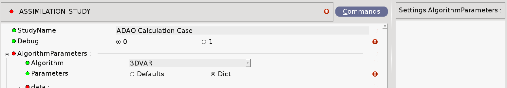

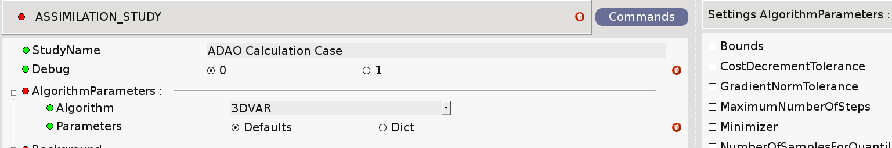

Adding/Deleting an optional keyword
------------------------------------

Optional keywords (if any) are in the right part of the "command window". Just double-click on the checkbox to add the keyword.
The input data form is redisplayed and the list of possible optional keywords will be updated (for example, if two keywords cannot be simultaneously present).

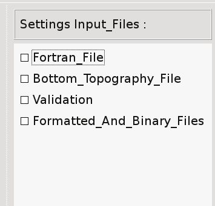

To delete a keyword (or a command), just click the garbage icon : 

|
Naming Concepts 
---------------

The icon for a command may be one of three colors: green, yellow or red. These colors represent the status of the command and the color meanings is : 
 - red for unvalid command, 
 - green for valid command,  
 - yellow for commands which have to be named.

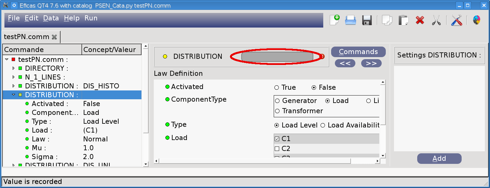

Tooltips 
--------

**Use tooltips to have information.**

- Tooltips on **labels** display **information about the keyword**. Double-click on the label to display this information in the comment area, at the bottom of the window. This is useful for long text. *(You also can double-click on the keyword in the tree dataset.)*

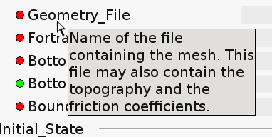

- Tooltips on **lineEdit** (one-line text editor) display **suggestion** for the input value. Suggestion are not very frequent. They are not default values, because you have to enter it explicitely.

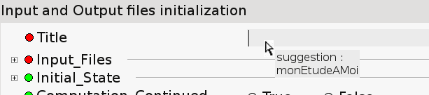

- Tooltips on **Red point**  display **information about the validity** for the keyword or for the group of keywords.
By double-clicking on the "red point" a window displaying the same information appears. It should be usefull if text
is too long to be read at one sitting.

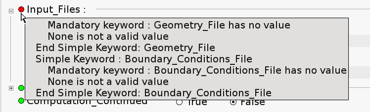

- Tooltips on **Commands Button**  explain what the icon/button represents, and which action is activated by clicking.

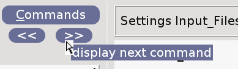
 
 
Context Menus 
--------------
In the dataset tree, context menus  (invoked by right-clicking) allow user to :

- create comments in the tree
- create parameter
- comment the command itself
- delete the node 

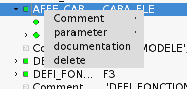

Some commands have associated scripts. They are easy to identify because the "run" icon is present : 

.. image:: images/Roue.png
   :align: right

.. image:: images/Scripts.png
   :align: center
