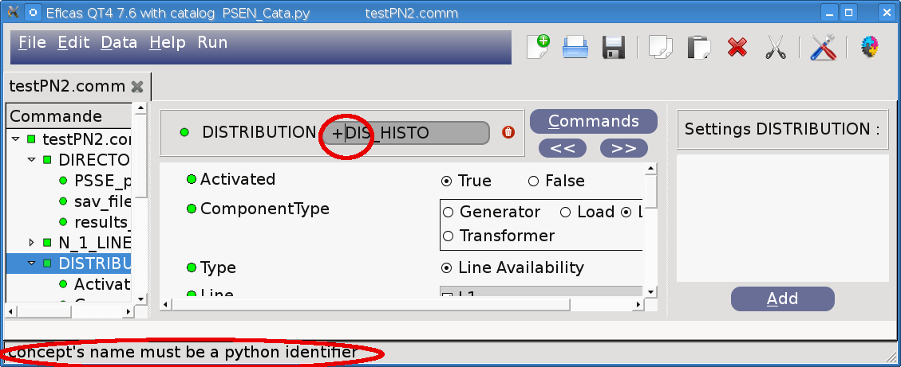

.. _python-label:

===============================
rules for python syntax
===============================

Variable names and identifiers are similar to those in many other languages :
----------------------------------------------------------------------------

* They start with a letter (A_Z or a-z) or underscore "_"".
* They are followed by letters, numbers or underscores.
* They are case-sensitive.
* A string is a sequence of caracters enclosed by a matching pair of single or double quotes.

Eficas does not allow you to use uncorrect names :

Some identifiers are reserved words :
-------------------------------------

* You can't use words of the python language as identifiers.
* Eficas itself uses identifiers which become reserved words. For example, you can't use the following words, even if it would make some interesting names:
	- BLOC, EXCLUS, OPER, ASSD,
	- EVAL, FACT, FORM, JDC,
	- REGLE, VALIDATOR, 
	- ETAPE, ENTITE

Python's way for  assigning values to variables: 
-------------------------------------------------

* Keep in mind that ".comm" are python files. The simplest form of assignement is : variable = value
* The hash character (#) starts a comment
* Tuples are enclosed in parentheses. 
* Lists are enclosed in bracked.
* In tuples or lists, a ',' follows each item especially the last one.

.. image:: images/ListeEtTuple.png

