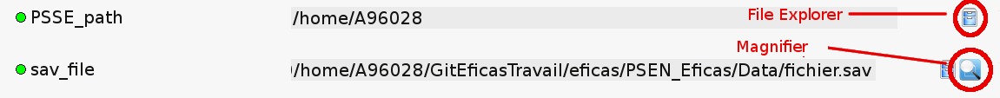
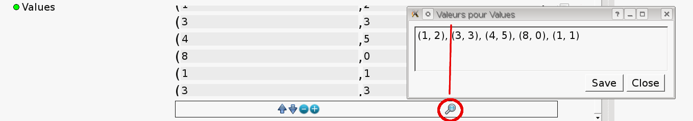
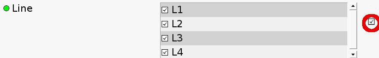
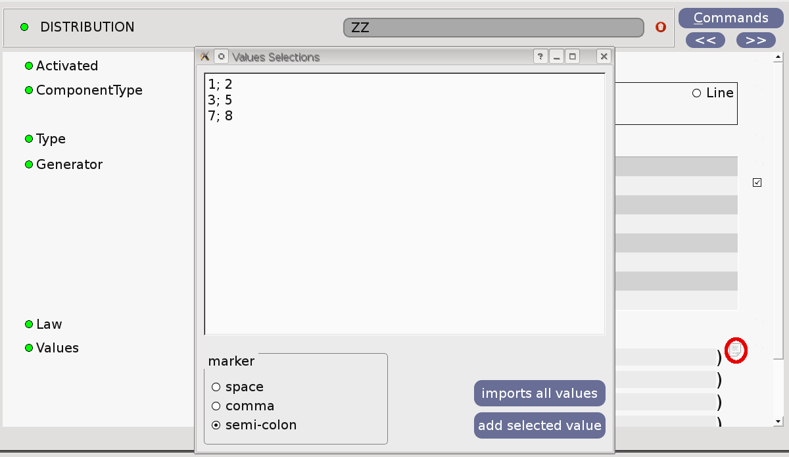
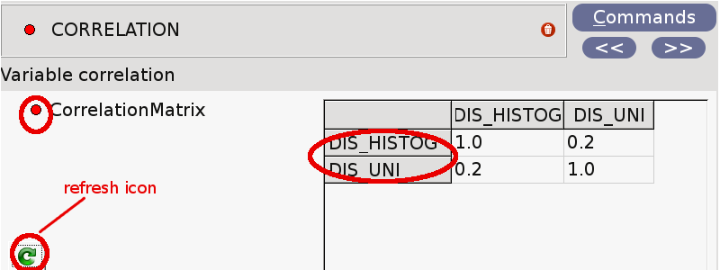

.. _features-label:

========================
Some Widgets Features 
========================

File or Directory
-----------------

+-------------------------------------+--------------------------------------------------+
| a File parameter has to be :        | if catalog's description is :                    |
+=====================================+==================================================+
|an existing file                     | type='Fichier'                                   |                
+-------------------------------------+--------------------------------------------------+
|a directory                          | type='Repertoire'                                |
+-------------------------------------+--------------------------------------------------+
|an existing file with specific suffix| type='Fichier','JDC Files (*.comm);;All Files (*)|
+-------------------------------------+--------------------------------------------------+
|a non-allready existing file         | type=('Fichier',"",'Sauvegarde'),                |
+-------------------------------------+--------------------------------------------------+
|a simple string                      | type='FichierNoAbs'                              |
+-------------------------------------+--------------------------------------------------+

The following widget allows users to enter  a directory (first) or a file. Magnifier icon is not avalaible when a directory is required.

- to open a file explorer, click on the corresponding icon. If a file suffix is required, content of the directory is filtered before being shown in the dialog, using a semicolon-separated list of filters specified.

- to view file content, click on magnifier icon. It uses xdg-open, which is a desktop-independent tool for opening files (according to suffix convention).

List
-----
List widgets have a toolbar down, under values area.

- Use the Up or Down arrows to move the selection in the list
- Use the Plus (or Minus) icon to add (delete) a new line
- Use the magnifier icon to see all the values in a modal widget

|

If lists are not ordered, it is possible to select all values by clicking the button on the right.

Import data from file
-----------------------

Data import icon provide access to data from ASCII text files.
Select the character that separates values in your text file and values you want to import.

Matrix
-------
Sometimes, matrix dimensions depend on the number of others parameters (for example, correlation matrix).
If a new variable is entered or if the name changes, matrix becomes invalid.
Users have to redisplay the header by pushing the refresh icon.

